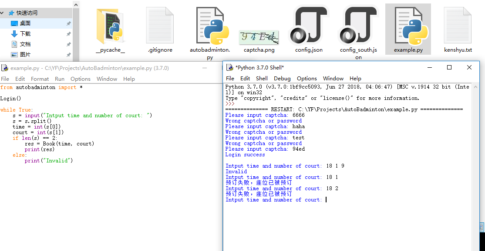

# **中大（东校区）羽毛球抢场脚本**

各项功能尚待完善，目前功能有限，希望有前辈能指点一二。

config.json中，nCourts代表场地个数，first_stock 和 first_stockdetailids 分别代表post请求时的两项参数，这两个参数为 stock 与 stockdetailids。

登陆时的验证码保存为了图片，与脚本处于同一路径下。

Book(time, court) 函数的返回值为一条服务器返回的json中的 "message" 项的值。

