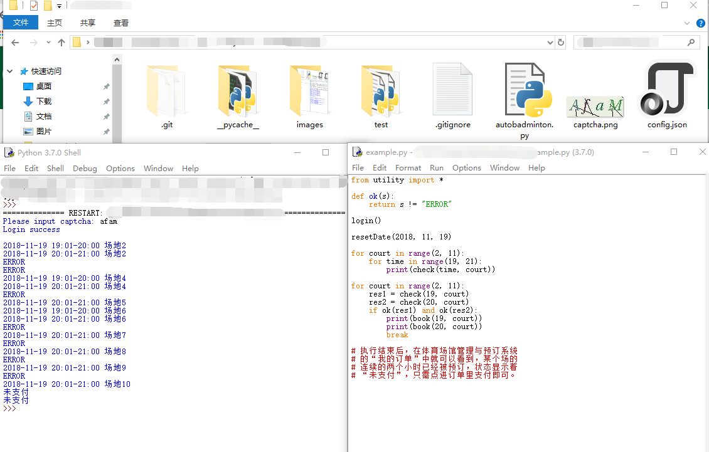
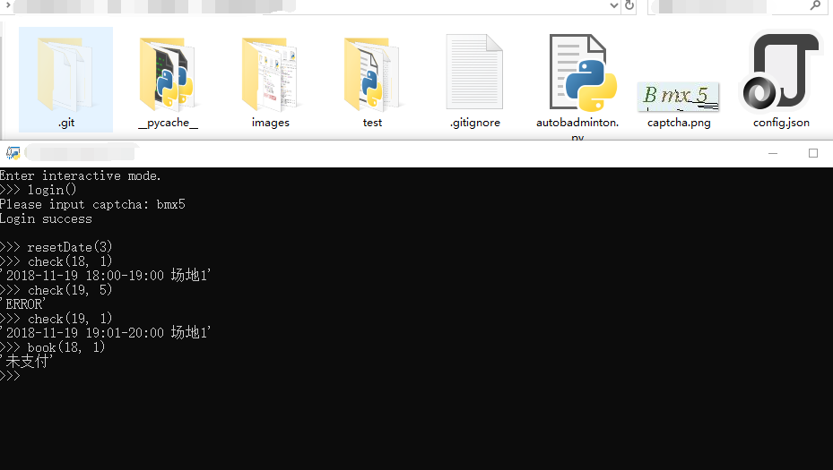

# **中大（东校区）羽毛球订场脚本快速上手**

所需第三方库：beautifulsoup4, requests

config.json 中的最后两项填写我校 NetID 和密码。

登陆时的验证码保存为了图片，与脚本处于同一路径下。

check(court, time) 检查该场地的信息，返回值为一个字符串，表示场地信息；若为“ERROR” ，正常情况下表示该场已经被预订（也就是说，已被预订的场无法查看信息），也有小概率表示脚本出了问题，麻烦在Issues里留言，谢谢 :)

book(court, time) 则是试图订场，返回值为字符串，若为“未支付”，则表示球场已经订到，还需要打开浏览器付一下钱。

resetDate(y, m, d) 可以把想要订场的日期重置为指定日期，初始时的日期为两天后。如果只传递一个参数，表明把日期重置为这么多天后（比如 resetDate(3)表示把日期重置为三天后）。

lst(start_time, end_time) 将打出一个表，内容为左闭右开的时间区间[start_time, end_time) 的场地是否有场。

autobadminton模块主要负责与服务器打交道，utility模块主要负责与写代码者打交道，可以选择像example一样，import utility模块，然后编写代码；也可以选择直接运行utility模块，以进入交互模式。

命令模式：

交互模式：

 

脚本尚且有许多待完善之处。

